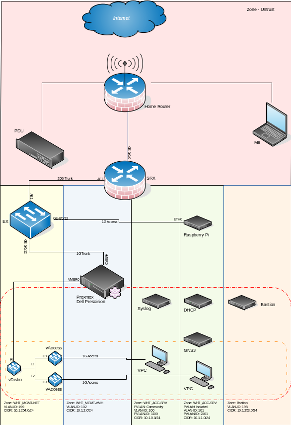

```
██╗  ██╗ ██████╗ ███╗   ███╗███████╗    ██╗      █████╗ ██████╗ 
██║  ██║██╔═══██╗████╗ ████║██╔════╝    ██║     ██╔══██╗██╔══██╗
███████║██║   ██║██╔████╔██║█████╗      ██║     ███████║██████╔╝
██╔══██║██║   ██║██║╚██╔╝██║██╔══╝      ██║     ██╔══██║██╔══██╗
██║  ██║╚██████╔╝██║ ╚═╝ ██║███████╗    ███████╗██║  ██║██████╔╝
╚═╝  ╚═╝ ╚═════╝ ╚═╝     ╚═╝╚══════╝    ╚══════╝╚═╝  ╚═╝╚═════╝ 
```

The lab sits as an enclave in my home.  This allows me to treat it as a private entity to test against as if it were a network facing the internet.  This also allows me to do whatever I want to the configuration without impacting my home network and the inhabitants therin.

## Network

|Manufacturer|Device|Model|Role|Firmware|Configuration|
|:-|:-|:-|:-|:-|:-|
|Juniper|SRX|550|Router/Firewall|12.3|[Config](./configurations/srx.conf)|
|Juniper|EX|4300-48P|Distro/Edge|19.4|[Config](./configurations/ex.conf)|
|Dell|Precision|7510|Hypervisor|Proxmox 9.1.1||


## Security Topology


## Bastion

In lieu of exposing all the devices in the lab to my home network, I created a bastion host and allow SSH via that.  The bastion sits in its own VLAN and Subnet to allow for proper isolation.  The host is Rocky Linux 9, but I will be changing that over to Oracle Linux 9 at some point.  Network security is very lax at this point as the implementation is pretty much in the building phase.

Accessing the hosts in the lab requires the bastion to allow proxyjump and a proper SSH [Config](./configurations/ssh.conf).  I am using self generated SSH keys currently.  Copy the pub key to the device then use the priv key to access.  The bastion forwards your credentials down the line.


# DISCLAIMERS - Pennies for the Trolls

## IP Addresses

I use publically known prvate network addresses.  These addresses are set aside for use in your project and do not impact anyone else when you use them.  They also give ZERO information about some attack surface someone from a forreign nation could use to compromise my home.  To do that they would have to find my public address which I do not annotate.  In fact I have no clue what it is, as I have not checked.

|Network|Prefix|
|:-|:-|
|192.168.[0-254].0|24|
|172.16.0.0|16|
|10.0.0.0|8|

## SSH Key Based Authentication

I understand that you should never share your SSH private keys.  This is a learning activity.  I use the same [keys](./keys) for EVERYTHING here, and here they stay.  Feel free to use them to emulate and learn.

If you feel that somehow this lab has state secrets and these keys impact national security, please contact your local authority at 1(900)382-5968.  *Rates may apply